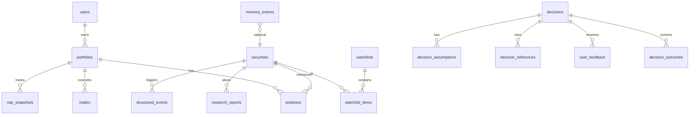

# 数据库结构设计

推荐技术栈：**PostgreSQL 15+**（JSONB 存结构化 AI 输出）+ **TimescaleDB 扩展**（可选，用于行情时序）+ **Redis**（行情缓存、任务队列）。

## ER 关系概览



---

## 一、基础主数据

### `users`

| 字段 | 类型 | 说明 |
|------|------|------|
| id | UUID PK | |
| email | VARCHAR UNIQUE | |
| display_name | VARCHAR | |
| investment_profile | JSONB | 风格偏好、市场范围、默认风险预算 |
| created_at | TIMESTAMPTZ | |

`investment_profile` 示例：

```json
{
  "markets": ["CN_A", "HK"],
  "style": ["fundamental", "quality_growth"],
  "risk_budget": { "max_drawdown_pct": 15, "max_single_name_pct": 10 },
  "forbidden_sectors": [],
  "notes": "重视回购与现金流"
}
```

### `securities`

统一标的表（A 股、港股）。

| 字段 | 类型 | 说明 |
|------|------|------|
| id | UUID PK | |
| symbol | VARCHAR | 如 `00700.HK`, `600519.SH` |
| name | VARCHAR | 中文名 |
| market | ENUM | `CN_A`, `HK`, `US` |
| currency | CHAR(3) | CNY, HKD |
| sector | VARCHAR | 申万/恒生行业 |
| industry | VARCHAR | 细分行业 |
| lot_size | INT | 最小交易单位 |
| is_active | BOOLEAN | |
| meta | JSONB | 上市日、指数成分等 |

索引：`(symbol, market)` UNIQUE，`sector`，`name` GIN（中文检索可选 pg_trgm）。

---

## 二、Phase 1 核心（组合地基）

### `watchlists` / `watchlist_items`

```sql
CREATE TABLE watchlists (
  id UUID PRIMARY KEY DEFAULT gen_random_uuid(),
  user_id UUID NOT NULL REFERENCES users(id),
  name VARCHAR(100) NOT NULL,
  description TEXT,
  created_at TIMESTAMPTZ DEFAULT now()
);

CREATE TABLE watchlist_items (
  id UUID PRIMARY KEY DEFAULT gen_random_uuid(),
  watchlist_id UUID NOT NULL REFERENCES watchlists(id) ON DELETE CASCADE,
  security_id UUID NOT NULL REFERENCES securities(id),
  tier ENUM('core', 'track', 'idea') DEFAULT 'track',
  thesis_summary TEXT,
  added_at TIMESTAMPTZ DEFAULT now(),
  UNIQUE(watchlist_id, security_id)
);
```

### `portfolios`

| 字段 | 类型 | 说明 |
|------|------|------|
| id | UUID PK | |
| user_id | UUID FK | |
| name | VARCHAR | 如「主模拟组合」 |
| base_currency | CHAR(3) | |
| initial_cash | DECIMAL(20,4) | |
| cash_balance | DECIMAL(20,4) | 当前现金 |
| benchmark_symbol | VARCHAR | 如 `HSI`, `CSI300` |
| risk_limits | JSONB | 与 Risk Agent 对齐 |
| status | ENUM | `active`, `archived` |

`risk_limits` 示例：

```json
{
  "max_single_name_pct": 10,
  "max_sector_pct": 25,
  "max_gross_exposure_pct": 95,
  "min_cash_pct": 5
}
```

### `positions`

| 字段 | 类型 | 说明 |
|------|------|------|
| id | UUID PK | |
| portfolio_id | UUID FK | |
| security_id | UUID FK | |
| quantity | DECIMAL(20,4) | 股数 |
| avg_cost | DECIMAL(20,6) | 成本价（标的币种） |
| market_value | DECIMAL(20,4) | 冗余，日终更新 |
| weight_pct | DECIMAL(8,4) | 占组合净值 % |
| opened_at | DATE | 首次建仓 |
| updated_at | TIMESTAMPTZ | |

UNIQUE `(portfolio_id, security_id)`。

### `trades`（模拟成交）

| 字段 | 类型 | 说明 |
|------|------|------|
| id | UUID PK | |
| portfolio_id | UUID FK | |
| security_id | UUID FK | |
| decision_id | UUID FK NULL | 关联决策单 |
| side | ENUM | `buy`, `sell` |
| quantity | DECIMAL | |
| price | DECIMAL | 成交价（模拟可按收盘价/VWAP） |
| amount | DECIMAL | 成交金额 |
| commission | DECIMAL | 佣金模型 |
| trade_date | DATE | |
| source | ENUM | `manual`, `agent`, `rebalance` |
| note | TEXT | |

### `nav_snapshots`（净值曲线）

| 字段 | 类型 | 说明 |
|------|------|------|
| id | UUID PK | |
| portfolio_id | UUID FK | |
| snapshot_date | DATE | |
| nav | DECIMAL | 组合净值 |
| cash | DECIMAL | |
| gross_exposure | DECIMAL | |
| daily_return_pct | DECIMAL | |
| cumulative_return_pct | DECIMAL | |
| drawdown_pct | DECIMAL | 相对历史高点 |
| benchmark_return_pct | DECIMAL | 可选 |

UNIQUE `(portfolio_id, snapshot_date)`。

### `pnl_records`（盈亏明细，日频或交易后）

| 字段 | 类型 | 说明 |
|------|------|------|
| id | UUID PK | |
| portfolio_id | UUID FK | |
| security_id | UUID FK NULL | NULL=组合级 |
| period_type | ENUM | `daily`, `trade`, `mtd`, `ytd` |
| period_start | DATE | |
| realized_pnl | DECIMAL | |
| unrealized_pnl | DECIMAL | |
| attribution | JSONB | Phase 4 填行业/因子归因 |

---

## 三、决策系统（护城河核心）

### `decisions`（决策单主表）

| 字段 | 类型 | 说明 |
|------|------|------|
| id | UUID PK | |
| portfolio_id | UUID FK | |
| security_id | UUID FK | |
| action | ENUM | 见下表 |
| current_weight_pct | DECIMAL | |
| target_weight_pct | DECIMAL | |
| delta_weight_pct | DECIMAL | |
| status | ENUM | `draft`, `approved`, `executed`, `cancelled`, `superseded` |
| confidence_grade | VARCHAR | 如 `B+` |
| holding_period | VARCHAR | 如 `3-6个月` |
| decision_reason | TEXT | 摘要 |
| main_risks | JSONB | 字符串数组 |
| review_conditions | JSONB | 复盘/止损逻辑（假设驱动） |
| cio_summary | JSONB | CIO Agent 完整结构化输出 |
| research_view_id | UUID FK NULL | 关联研究观点（非交易） |
| created_by_agent | VARCHAR | 如 `cio_agent` |
| created_at | TIMESTAMPTZ | |
| executed_at | TIMESTAMPTZ NULL | |

**action 枚举**：`buy`, `sell`, `hold`, `add`, `reduce`, `watch`, `ban`。

### `decision_assumptions`（核心假设，可多条）

| 字段 | 类型 |
|------|------|
| id | UUID PK |
| decision_id | UUID FK |
| assumption_text | TEXT |
| measurable | BOOLEAN |
| metric_key | VARCHAR NULL | 如 `game_revenue_yoy` |
| target_value | VARCHAR NULL |
| deadline | DATE NULL |

### `decision_references`（参考信息溯源）

| 字段 | 类型 |
|------|------|
| id | UUID PK |
| decision_id | UUID FK |
| ref_type | ENUM | `news`, `filing`, `research_report`, `valuation`, `factor`, `user_note` |
| ref_id | UUID | 指向对应表 |
| excerpt | TEXT | |
| relevance_score | DECIMAL NULL |

### `research_views`（研究观点，与交易分离）

| 字段 | 类型 |
|------|------|
| id | UUID PK |
| security_id | UUID FK |
| view_type | ENUM | `company`, `industry`, `event` |
| rating | ENUM | `strong_buy`…`sell`, `neutral` |
| horizon | VARCHAR | |
| content_structured | JSONB | 十段式基本面模板 |
| valuation_snapshot | JSONB | |
| scenario_analysis | JSONB | 乐观/中性/悲观 |
| agent_name | VARCHAR |
| version | INT | |
| supersedes_id | UUID NULL | |
| created_at | TIMESTAMPTZ |

### `user_feedback`

| 字段 | 类型 |
|------|------|
| id | UUID PK |
| user_id | UUID FK |
| target_type | ENUM | `decision`, `research_view`, `daily_report` |
| target_id | UUID |
| rating | INT | 1-5 |
| correction | TEXT |
| tags | JSONB | 如 `too_early`, `ignored_risk` |
| created_at | TIMESTAMPTZ |

---

## 四、Phase 2 信息与结构化层

### `market_bars`（行情，建议分区表）

| 字段 | 类型 |
|------|------|
| security_id | UUID |
| bar_date | DATE |
| interval | ENUM | `1d`, `1m` |
| open, high, low, close | DECIMAL |
| volume, turnover | DECIMAL |
| turnover_rate | DECIMAL NULL |

PRIMARY KEY `(security_id, bar_date, interval)`。

### `financial_statements` / `financial_metrics`

报表原始 + 解析后指标（ROE、毛利率、FCF 等），`period` + `statement_type` 索引。

### `filings`（公告）

| 字段 | 类型 |
|------|------|
| id | UUID PK |
| security_id | UUID FK |
| filing_type | VARCHAR |
| title | TEXT |
| published_at | TIMESTAMPTZ |
| source_url | TEXT |
| raw_content | TEXT |
| parsed_structured | JSONB |

### `news_articles` / `research_documents`

用户上传或抓取；`parsed_structured` 走统一 **Structured Event** 格式。

### `structured_events`（信息处理层核心）

| 字段 | 类型 | 说明 |
|------|------|------|
| id | UUID PK | |
| source_type | ENUM | `news`, `filing`, `social`, `report` |
| source_id | UUID | |
| companies | JSONB | `[{security_id, name}]` |
| event_type | VARCHAR | 如 `earnings_release` |
| impact_direction | ENUM | `positive`, `negative`, `neutral`, `mixed` |
| impact_dimensions | JSONB | `["revenue", "margin"]` |
| confidence | ENUM | `low`, `medium`, `high` |
| time_sensitivity | ENUM | `low`, `medium`, `high` |
| related_securities | JSONB | security_id 列表 |
| follow_ups | JSONB | 需跟踪变量 |
| extracted_at | TIMESTAMPTZ | |

索引：GIN on `companies`, `related_securities`；`event_type`, `published_at`。

---

## 五、Phase 3 Agent 运行记录

### `agent_runs`

| 字段 | 类型 |
|------|------|
| id | UUID PK |
| workflow_name | VARCHAR | 如 `daily_cio_decision` |
| trigger | ENUM | `scheduled`, `manual`, `event` |
| input_context | JSONB | |
| output | JSONB | |
| status | ENUM | `running`, `success`, `failed` |
| started_at / finished_at | TIMESTAMPTZ |

### `agent_messages`（多 Agent 对话轨迹，可选）

run_id, from_agent, to_agent, payload JSONB, created_at。

---

## 六、Phase 4 记忆与进化

### `decision_outcomes`（决策结果跟踪）

| 字段 | 类型 |
|------|------|
| decision_id | UUID FK UNIQUE |
| outcome_status | ENUM | `open`, `closed`, `invalidated` |
| return_since_decision_pct | DECIMAL |
| max_drawdown_pct | DECIMAL |
| assumption_results | JSONB | 每条假设对/错 |
| what_went_right | TEXT |
| what_went_wrong | TEXT |
| closed_at | TIMESTAMPTZ |

### `memory_entries`（Decision Memory）

| 字段 | 类型 |
|------|------|
| id | UUID PK |
| memory_type | ENUM | `lesson`, `rule`, `anti_pattern`, `user_preference` |
| title | VARCHAR |
| content | TEXT |
| evidence_decision_ids | UUID[] |
| confidence | DECIMAL |
| active | BOOLEAN |
| version | INT |
| created_at | TIMESTAMPTZ |

### `strategy_rules`（可执行规则片段）

| 字段 | 类型 |
|------|------|
| id | UUID PK |
| rule_code | VARCHAR UNIQUE |
| natural_language | TEXT |
| machine_check | JSONB | Risk/Portfolio Agent 可解析 |
| source_memory_id | UUID FK NULL |

---

## 七、日报与任务

### `daily_portfolio_reports`

| 字段 | 类型 |
|------|------|
| portfolio_id | UUID |
| report_date | DATE |
| summary_md | TEXT |
| metrics | JSONB | 净值、换手、暴露 |
| top_movers | JSONB |
| agent_commentary | JSONB |
| UNIQUE(portfolio_id, report_date) |

### `ingestion_jobs` / `data_source_configs`

Data Agent 调度：源、频率、最后成功时间、错误计数。

---

## 八、关键 JSON Schema 引用

结构化 AI 输出定义见 `/workspace/schemas/`：

- `structured_event.schema.json`
- `research_view.schema.json`
- `decision_order.schema.json`
- `valuation_scenario.schema.json`
- `review_attribution.schema.json`

---

## 九、索引与性能建议

1. 所有外键列建 B-tree 索引；`decisions(created_at DESC)` 供 Decisions 页。
2. `structured_events` 按 `published_at DESC` 部分索引最近 90 天。
3. 行情表按月分区；日终批处理更新 `positions.market_value` 与 `nav_snapshots`。
4. 敏感用户数据行级安全（RLS）按 `user_id` 隔离（Supabase/自建均可）。
