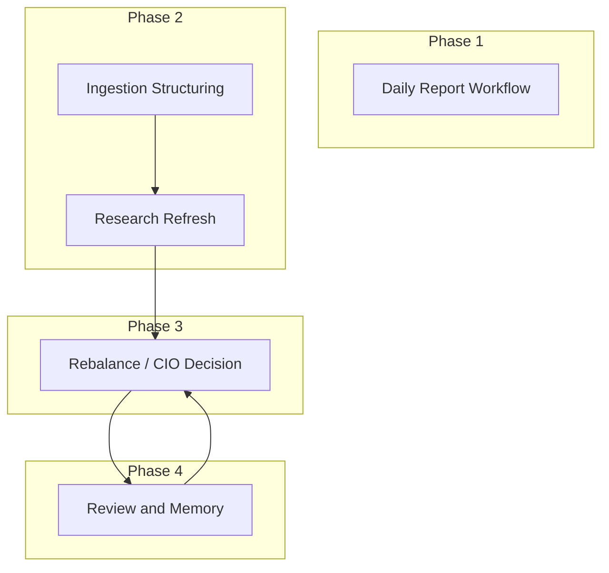
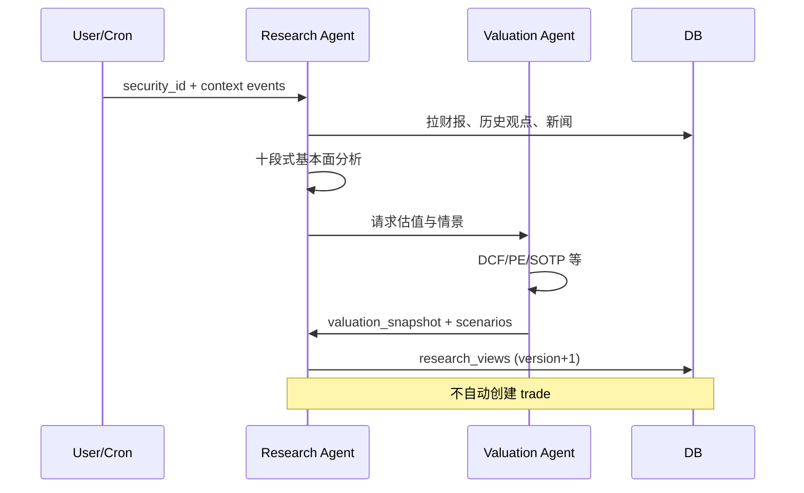

# AI Agent 工作流设计

编排推荐：**LangGraph** 或显式 **状态机**（便于审计）。所有节点输出必须符合 `/workspace/schemas/`。

---

## 工作流总览



---

## 1. Daily Report Workflow（Phase 1）

**触发**：交易日 19:00 或手动。

| 步骤 | 执行者 | 输入 | 输出 |
|------|--------|------|------|
| 1 | nav-pnl 模块 | 持仓、行情 | metrics JSON |
| 2 | reporting Agent | metrics + 昨日决策 | `daily_portfolio_reports` |
| 3 | 可选 | 开放假设列表 | 报告中「待验证假设」段落 |

**无自动交易**。仅叙述与提醒。

---

## 2. Ingestion & Structuring（Phase 2）

**触发**：新文章/公告入库。

```
Raw Document
    → Data Agent（清洗、去重、关联 security_id）
    → Structuring Agent（提取 structured_event）
    → 写入 structured_events
    → 若 time_sensitivity=high → 通知 Research Agent
```

**Structuring Agent 工具**

- `resolve_security(names[])` → security_id
- `get_recent_events(security_id, days)` → 避免重复
- `save_structured_event(schema)` → 校验 JSON Schema

**提示词要点**：必须填 `follow_ups`；禁止无 security 的模糊事件进入组合流程。

---

## 3. Research Refresh Workflow（Phase 2）

**触发**：财报发布、重大事件、用户手动。



**输出**：`research_views.content_structured` + `rating` + `scenario_analysis`。

---

## 4. Rebalance / CIO Decision Workflow（Phase 3）⭐

**触发**：每日定时 / 用户「生成调仓建议」/ 重大事件。

### 阶段 A：并行研究（已有则跳过）

| Agent | 输出 |
|-------|------|
| Research | 最新 view 或增量更新 |
| Valuation | 目标价区间、三情景 |
| Factor | 因子得分、拥挤度警告 |

### 阶段 B：组合草案

**Portfolio Agent**

- 输入：所有 watchlist/持仓标的 views + 当前 positions + 用户 investment_profile
- 输出：`proposed_weights[]` + 调仓理由草案
- 约束：不得违反 `strategy_rules` + `memory_entries` 中的 anti_pattern

### 阶段 C：风控审查

**Risk Agent**

```json
{
  "approved": false,
  "violations": [
    { "code": "SINGLE_NAME_CAP", "security": "00700.HK", "proposed": 12, "limit": 10 }
  ],
  "suggestions": [{ "action": "reduce", "target_weight": 10 }]
}
```

- 若不通过：退回 Portfolio Agent 一轮（最多 2 轮），仍失败则仅输出 `watch` 级建议。

### 阶段 D：CIO 决策

**CIO Agent**

- 输入：Research + Valuation + Factor + Risk 结果 + Memory 检索（Top 5 相关教训）
- 输出：**完整决策单** → `decision_order.schema.json`
- 规则：
  - 每个 `add/buy/reduce/sell` 必须 ≥1 条 `assumption` 和 ≥1 条 `review_condition`
  - 复盘条件**假设驱动**，非单纯价格止损
  - `ban` 用于风控否决或用户禁止项

### 阶段 E：人工闸门（MVP 强烈建议）

```
CIO 输出 status=draft
    → 用户在 Decisions 页 Approve
    → SimTradeExecutor 执行 status=executed
```

全自动执行放到用户显式开启之后。

---

## 5. Review & Memory Workflow（Phase 4）

**触发**：复盘日到期、决策 closed、用户反馈提交。

| 步骤 | Agent | 动作 |
|------|-------|------|
| 1 | Review Agent | 对比假设 vs 实际（行情、财报、事件） |
| 2 | Review Agent | 填写 decision_outcomes |
| 3 | Review Agent | 生成 lesson 候选 → memory_entries (pending) |
| 4 | 用户确认 | active=true → 写入 strategy_rules |
| 5 | 反馈嵌入 | user_feedback → 更新 user investment_profile 权重 |

**Memory 检索（CIO 前）**

```
query = f"{sector} {action} {event_type} 历史教训"
→ vector + keyword 混合检索 memory_entries
→ 注入 CIO system prompt
```

---

## Agent 工具清单（共享）

| 工具 | 使用者 |
|------|--------|
| `get_portfolio_state(portfolio_id)` | Portfolio, CIO, Risk |
| `get_research_view(security_id)` | 全部研究类 |
| `search_events(filters)` | Research, CIO |
| `search_memory(query)` | CIO, Portfolio, Review |
| `check_risk(proposed_weights)` | Risk |
| `create_decision(draft)` | CIO |
| `get_market_bars(symbol, range)` | Valuation, Factor |

---

## 提示词结构模板（CIO）

```text
你是 CIO Agent。目标：输出模拟投资决策，而非预测涨跌。

【用户投资宪法】
{investment_profile + active strategy_rules + top memory_entries}

【组合现状】
{positions, cash, risk_limits}

【研究输入】
{research_views summaries}

【风控结果】
{risk_agent output}

要求：
1. 区分 research_rating 与 trade_action
2. 每条交易动作附带 assumptions 与 review_conditions
3. 仅输出合法 JSON，符合 decision_order schema
```

---

## 失败与降级

| 场景 | 行为 |
|------|------|
| 行情缺失 | 跳过因子；决策标记「数据不完整」 |
| LLM 超时 | 保存 agent_run failed；重试 1 次 |
| Schema 校验失败 | 不写入 decisions；返回错误给前端 |
| Risk 不通过 | 仅输出 hold/watch 或缩小仓位建议 |
