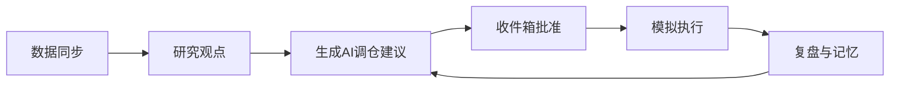

# AIMS 当前版使用指南

面向已用 Docker 跑通 `http://localhost:8080` 的用户。完整部署见 [DEPLOY.md](./DEPLOY.md)；Agent 与 LLM 配置见 [DATA_AND_AGENTS.md](./DATA_AND_AGENTS.md)。

## 产品边界

- **模拟盘**：成交仅在系统内记账，不连接券商实盘。
- **AI 只产 draft**：调仓结果为决策草稿，须在 **收件箱** **批准** 后再 **执行**。
- **默认 `AGENT_MODE=rule`**：不配 API Key 可完整演示；配置 Key 后为证据卷宗 + LLM 决策。



---

## 环境与启动

| 步骤 | 操作 |
|------|------|
| 更新代码 | `git pull origin main` |
| 启动 | `docker compose -f docker-compose.prod.yml up -d --build` |
| 访问 | http://localhost:8080 |
| 改前端后 | `docker compose -f docker-compose.prod.yml build --no-cache web` |
| 改 API / `.env` | `docker compose -f docker-compose.prod.yml up -d --build api` |

根目录 `.env` 示例：

```env
AGENT_MODE=rule

# 可选：LLM
# AGENT_MODE=llm
# OPENAI_API_KEY=sk-...
# LLM_MODEL=gpt-4o-mini
# CIO_DECISION_MODE=batch
# CIO_REFRESH_RESEARCH=false
# CIO_MAX_SYMBOLS=12
```

---

## 导航与各页面

| 页面 | 路径 | 用途 |
|------|------|------|
| 总览 | `/` | 净值、今日待办、净值曲线、最新决策 |
| 组合 | `/portfolio` | 持仓/成交、风险仪表、**生成 AI 调仓建议** |
| 股票池 | `/watchlist` | 关注标的（进入调仓 universe） |
| 决策日志 | `/decisions` | 全部决策历史 |
| 收件箱 | `/decisions/inbox` | 待批准 draft（证据 A/B/C） |
| 研究 | `/research` | 观点列表；个股页可生成/编辑研究 |
| 信息流 | `/events` | 结构化公告/新闻 |
| 数据 | `/data` | 全量同步、数据质量 |
| 复盘 | `/review` | 到期复盘、记忆、Agent 运行 |
| 画像 | `/settings` | 风险预算、禁止项、研究最大天数 |
| 规则 | `/rules` | 投资宪法，CIO 会读取 |

---

## 推荐使用顺序

### 1. 画像与股票池（一次性）

1. **画像** `/settings`：单票/行业上限、最低现金、禁止清单、`research_max_age_days`。
2. **股票池** `/watchlist`：添加关注标的（与持仓一并参与调仓）。

### 2. 数据（每次用前或每日）

1. **数据** `/data` → **全量同步**（行情、公告、财报）。
2. 查看覆盖率；同步成功后可自动记 NAV（`AUTO_NAV_AFTER_SYNC` 默认开启）。

净值曲线若与顶部数字严重不符（历史演示数据污染），可重置：

```bash
curl -X POST "http://localhost:8080/api/v1/portfolios/<组合ID>/nav/reset"
```

组合 ID：浏览器访问 `http://localhost:8080/api/v1/portfolios` 查看。

### 3. 研究（调仓前）

1. **研究** → 进入个股 → **生成研究草稿** → 编辑 → **保存**。
2. 人工保存（`agent_name=human`）不会被 `CIO_REFRESH_RESEARCH` 自动覆盖。

### 4. 生成调仓草案

1. **组合** `/portfolio` → **生成 AI 调仓建议**。
2. 流水线：可选刷新研究 → Valuation → Factor → Portfolio → Risk → Dossier → CIO。
3. **复盘** 页可查看 Agent 运行 `trace`（`dossiers`、`cio_mode`）。

### 5. 收件箱批准与执行

1. **收件箱**：优先查看证据 **C**，再批准。
2. **执行** 已批准决策 → 更新模拟持仓。
3. **决策详情** → **溯源**：卷宗、引用、证据分。

### 6. 复盘闭环

1. **复盘**：到期决策、跑复盘、生成 lesson 记忆。
2. **激活** 记忆后，下次调仓会注入 CIO（见 trace.memories）。

---

## 总览「今日待办」

- 待复盘 → `/review`
- 待批准 / 低证据草案 → `/decisions/inbox`
- 待执行 → `/decisions/inbox?tab=approved`
- 数据过期 → `/data`
- 事件复审 → `/events`

---

## 规则模式 vs LLM 模式

| 维度 | `rule`（默认） | `llm` + Key |
|------|----------------|-------------|
| 成本 | 0 | 按调用计费 |
| 辨认 | 组合页 `Agent 模式：rule` | `llm`，trace 中 `cio_mode=llm` |
| 失败 | — | 自动回退规则 CIO |

进阶：`CIO_DECISION_MODE=per_symbol`、`CIO_REFRESH_RESEARCH=true`、`REBALANCE_CRON_CHAIN_AFTER_SYNC=true`（同步后自动产 draft，仍须人工批准）。

---

## 常见问题

1. **导航无收件箱/画像**：`git pull` 后需 `build --no-cache web`。
2. **收件箱为空**：权重变化 &lt;1% 可能不产出；研究闸门可能降为 `watch`。
3. **LLM 未生效**：确认 `.env` 已传入 api 容器并 `build api`。

---

## 两种用法建议

**A. 零成本熟悉（第一周）**  
`rule` → 同步 → 研究 → 调仓 → 收件箱 → 执行 → 复盘。

**B. 个人辅助决策**  
`llm` + 重点看证据 C 与溯源 → 只批准能辩护的 draft。
